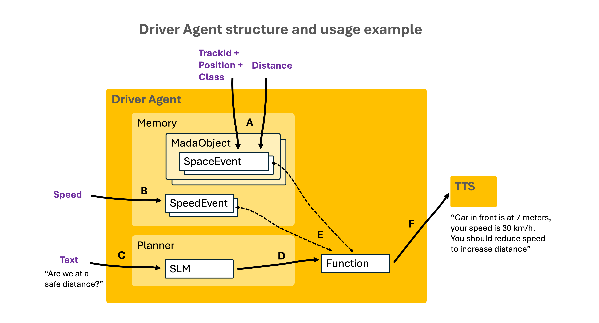

# Basic Multimodal Agentic Driver Assistant (MADA)

This MADA project's goal is having a minimum, but as functional as possible, **driver assistant** that works outdoor. 
Among the functionalities provided by MADA are:
- **safety distance checking**: If there is a vehicle in front, and the current distance is lower than the safety distance 
for the current speed, MADA warns with an audio message.
- **speed assistance**: When a speed limit traffic sign is detected, and the estimated speed is greater than the speed limit, 
MADA warns with an audio message.
- **person or traffic light warning**: When a person or traffic light is detected, it warns the driver.

### Why "multimodal" and "agentic"?
MADA is multimodal because it includes an SLM (Small Language Model) and is surrounded by speech input and output, 
RGB and depth images, speed data, accelerometer and gyroscope coordinates...
MADA can also be described as "agentic" because, although it has the components that correspond to an Agent 
(sensors, memory, planner, actions; hence the name of the Driver Agent module), it is not yet as functional to really be considered a complete Agent.

Regarding hardware, MADA is based on (and limited by) the following components I have at home:
- Intel Realsense D435i camera (which captures RGB and depth images)
- Samsung cell phone
- Apple M1 computer with (just) 8 GB of RAM

## Functional blocks
MADA is composed of several sensors and processing modules:
- the **camera** takes RGB and depth images. They are processed by the **Object Detector** in the computer, which detects 
objects (cars, traffic lights) and provides the object type, the bounding box and the position, along with the mean distance from the camera
- the **cell phone** gets the **speed** from the GPS, **recognizes driver speech requests**, gets the coordinates from the 
**accelerometer** and **gyroscope**, and sends all this data to the computer. On the other hand, the cell phone **provides wi-fi** to the computer.

All the data at the output of the processing modules are sent to the **Driver Agent**, which converts them into events 
to be stored in the Memory and analyzed in the Planner to assess if some action should be initiated.
The only outputs are speech audio warnings or suggestions. The approach is non-invasive: there is no intention to take 
control of the car, just to assist the driver with speech messages.

Next figure shows the functional blocks of MADA.


### Object Detector
The goal of an Object Detection model is to analyze an image and identify which object types, out of a given list, 
are there in the image (or frame), along with the bounding box of each object. MADA's Object Detector is fine-tuned to detect 
street objects: vehicles, people, traffic signs and traffic lights. It is based on YOLO v8 Object Detector model.

**Object Tracking**

After detection, tracking is performed to keep the objects uniquely identified in successive frames. 
Tracked objects and their associated space events are memorized in order to enable certain actions.

**Distance**

The depth image of the Intel Realsense D435i camera has a point-cloud format, which is filtered with only the points 
inside the bounding box limits of the object instance in the RGB image. The depth of those points is averaged, 
giving an average distance from the camera to the object as a result.
It is worth mentioning that depth cameras have a confidence range of distances; in the case of the 
Intel Realsense D435i is 0.1 – 3 meters, although still has quiet accuracy up to 6-7 meters; anyway, 
it would be better to have a camera with a range up to 20 meters or so.

### Speed estimation 
The speed is provided by a Kotlin app in the cell phone that takes it from the GPS.

### Speech recognition
Speech recognition was initially performed in the Mac by running whisper.cpp in stream mode. 
However, the execution required 1 GB of RAM, thus I decided to
implement speech recognition in the cell phone, in the same Kotlin app as the speed estimation. 
It uses the built-in capabilities of the Android cell phone.

### Driver Agent

The Driver Agent contains two modules: Memory and Planner

**Memory**

It enables the persistence of objects and events:
- MadaObject: all the types that can be detected by the object detector: vehicle, person, traffic light, traffic sign. 
Defined by an object type and a track id (which remains in successive frames to uniquely identify the object instance)
- SpaceEvent: attribute of a mada object instance. Defined by a bounding box, a position (left, front, right, 
depending on the center of the bounding box) and the distance to the camera
- SpeedEvent: stores the speed measured by the GPS in the cell phone
- ActionEvent: mainly used to avoid repeating the same action over the same object too soon 

**Planner**

The Planner leverages on a Small Language Model powered with basic **function-calling**, which is the ability that 
some LLMs and SLMs have to identify which function (from a given list) may be called to satisfy a driver request. 
The SLM currently used is Gemma2, which provides acceptable function-calling by default.

**Action types**

There are two types of actions:
- **automatic actions**: respond to one or more events that correspond to some kind of risk or danger. 
An example can be warning the driver that current speed is greater than that in a detected speed limit sign.
- **request motivated actions**: respond to a speech request from the driver. An example could be checking if there is a 
safety distance from a bus in front. Those requests are sent to an SLM in the Planner which can select a function to be called.

### Text To speech
Text-to-speech functionality is currently very simple: 
- a call to Google's gtts service, which takes a text and delivers an audio file of the spoken text
- a call to macOS `afplay` command, which takes an audio file and plays it

### Driver Agent Usage example
Next figure shows the Driver Agent structure with an example of use.



**A** The Object Detector scans RGB images at a given frame rate from the camera in order to detect MADA objects:
people, vehicles, traffic signs, traffic lights. When a MADA object is detected and tracked, a Space event is generated
in the Driver Agent's Memory, consisting of the detected class name, the trackId, the bounding box and the distance to the camera.

**B** Speed measurements are periodically collected from the GPS in the cell phone and sent to the server in the computer, 
where they are stored in the Driver Agent’s Memory.

**C** The driver requests if the distance to the vehicle in front is safe; the request is recognized in the cell phone, 
converted to text and sent to the SLM (Small Language Model) in the Driver Agent's Planner.

**D** The SLM scans the functions available and identifies if there is one that may satisfy the driver request. 

**E, F** This function gets event data from Memory and generates a text that is sent to the TTS to be converted to audio. 
In the example, the function gets the current speed and the distance from the camera to the car in front. Since the distance 
is lower than the safety distance at the current speed, it recommends the driver to reduce the speed.

## Datasets
The current version of MADA's Object Detector is a customization of the YOLO v8 Object Detector model, fine-tuned with 
images and annotations (when available) from several datasets:
- **Microsoft's COCO (Common Objects in COntext)**: includes more than 80 general image types, from which a few are useful 
for MADA: person, car, bus, bicycle, truck, motorcycle.
- **GTSDB (German Traffic Sign Detection Benchmark)**: composed of images and annotations of more than 40 traffic sign classes, 
and some of them have been selected for MADA: speed limits, stop, give way, roundabout, pedestrian crossing...
- **DFG-TSD (DFG Traffic Sign Dataset; DFG is a Slovenian company)**: includes more than 200 traffic sign classes, 
from which some have been selected to complement those less represented in GTSDB or not included: some speed limits, 
dead end street, no left turn, no right turn, no priority.
- **S2TLD (SJTU Small Traffic Light Detection; SJTU is Shanghai Jiao Tong University)**: provides traffic light images 
and annotations, with separate types for red, green and yellow lights.

### Image annotation

Since images from each of the datasets might have non-annotated instances of classes considered only in another dataset 
(for instance, the images in the S2TLD dataset have only annotations of traffic lights, but there are also non-annotated 
cars, crossing people and traffic signs), I had to review the whole dataset to add annotations (labels and bounding boxes) for the non-annotated instances.
The merging of images and annotations from different datasets was finalised in the **Roboflow platform**.

**Speed limit signs and OCR**

Initially, I considered each speed limit as a separate type; since it is difficult to get a balanced number images from all speed limits, 
it was also difficult to make the YOLO model detect them properly: the confusion matrix showed there were frequent inter-speed limit errors. 
Then I decided to merge all the speed limits into just one type and apply an OCR to the bounding box image.

**Traffic lights transitions**

Initially, there were separate types for red, green and yellow lights. However, I realized it is convenient to manage 
transitions between lights as states inside the same traffic light instance; for example, green to yellow is interpreted as a speed reduction action, 
while red to yellow is interpreted as a pedestrian crossing warning, both inside the same traffic light instance.
Therefore, I decided to merge the 3 traffic light types into one, where the state corresponds to the color which is
assigned by applying classic computer vision techniques to the bounding box image.

### Final dataset

After the speed limits and traffic lights mergings, the resulting dataset is composed of **3160 training images** and 
**750 validation images**, and the corresponding label files which totalize a **minimum of 200 annotations of 23 different image classes**.

(TODO) Imagen de las 23 classes (imagen y texto)

(TODO) Training: Google Colab 2 hours, MAP, etc

## Code structure
The code is distributed in four folders:
- **android-apps**: contains two project folders for two Android apps
- **object-detector**: contains python files implementing the **Object Detector** module functions
- **driver-agent**: contains python files implementing the **Driver Agent** module
- **common**: contains python files for the **Text to speech** module, and other python files used by the other modules

### android-apps
Contains two project folders for two Kotlin apps to be built in Android Studio and installed in an Android cell phone: 
- **SpeedVoiceWebSocket**: gets the speed from the GPS and transforms the driver speech requests into text; then sends 
that data as webSocket messages to the webSockets server in the computer. The Speed is provided by the **com.google.android.gms.location** 
package, which interfaces with the GPS sensor. The driver speech is recognised and converted into text by the package **android.speech.SpeechRecognizer**.
- **AccelGyroWebSocket**: gets the coordinates from the **accelerometer** and **gyroscope**, and sends them as webSockets 
messages to the webSockets server in the computer. The Accelerometer and Gyroscope coordinates are provided by the **android.hardware.Sensor** package.

### object-detector
Contains the following python files:
- `object_detection_loop.py`: implements the object detection and tracking loop; in "live" mode it captures the RGB and Depth images 
from the camera; otherwise, it takes them from recorded videos.
- `realsense_camera.py`: implements the RealSenseCamera class, which wraps all the RealSense camera code.
- `recorded_video_manager.py`: implements the RecordedVideoManager, which manages offline recorded videos.
- `object_detector.py`: it also applies character recognition (through PaddleOCR) to the speed limit signs bounding boxes.
- `record_rgb_and_depth_videos.py`: records RGB and depth videos to test changes in the object detector indoor without having to use the camera outdoor.

It also contains other files used by the python files:
- `yolov8m_.pt`: customized model used by the object detector
- `object_detector.yaml`: contains the configuration parameters that are used by the python functions and classes in the object-detector folder

### driver-agent
Contains the following python files:
- `driver_agent_events_handler.py`: implements the driver agent events handler through a webSockets server that receives 
websocket messages from the processing modules (apps in the cell phone and object detector in the computer) and converts 
them into events to be stored and processed
- `driver_agent.py`: implements the DriverAgent class, which contains as attributes the Memory and Planner classes; 
implements the Planner class, which manages the SLM that supports the **driver request initiated actions**; it also performs 
the evaluation of both automatic and request initiated actions
- `memory.py`: contains all class definitions to support the persistence of base objects and events
- `mada_classes.py`: implements all the classes with the behaviour of specific MADA types: vehicles, people, traffic signs, traffic lights
- `functions.py`: includes the definition of the functions supporting the driver assistance actions
- `functions_schema.py`: automatically generates function schemas by parsing the function definitions in `functions.py`. 
The schemas are used by the SLM in the Driver Agent's Planner to decide if one of the existing functions must be called. 
It also contains a FunctionParser class used by the Driver Agent's Planner to parse the JSON output of the SLM in function calling 
mode and ensure the function exists and is correctly called

It also contains other files used by the python files:
- `driver_agent.yaml`: contains the configuration parameters that are used by the python functions and classes in the driver-agent folder

### common
Contains python files used both by the object detector and the driver agent:
- `text_to_speech.py`: includes the functions to manage the text-to-speech functionality
- `utils.py`

## Installation instructions
Clone the repository:
```
git clone https://github.com/albertojulian/mada-driver-assistant.git
```
### Android apps
- Copy the folders in android-apps into AndroidStudioProjects
- Open Android Studio
- Connect the cell phone with a USB cable

### Object Detector
Install ffmpeg and the libusb library with homebrew (Realsense camera needs a dual version of libusb: arm and x86)
```
brew install ffmpeg libusb
```

Create a virtual conda environment and activate it:
```
conda create --name OBJECT_DETECTOR python=3.9.9
conda activate OBJECT_DETECTOR
```

Use conda to install torch
```
conda install -c pytorch pytorch=2.2.1 torchvision=0.17.1
```

Use conda to install opencv (includes the python wrapper)
```
conda install -c conda-forge opencv=4.8
```

Use pip to install the libraries in requirements.txt
```
cd object-detector; pip install -r requirements.txt
```

### Driver Agent
Install Ollama

Create a virtual conda environment and activate it:
```
conda create --name DRIVER_AGENT python=3.9.9
conda activate DRIVER_AGENT
```

Use conda to install torch
```
conda install -c pytorch pytorch=2.2.1 torchvision=0.17.1
```

Use pip to install the libraries in requirements.txt
```
cd driver-agent; pip install -r requirements.txt
```


## Execution instructions
- In the Cell Phone: turn on GPS and Shared Connection
- In the Computer:
  - connect the camera to the computer
  - link to the cell phone wi-fi
  - open a terminal
    - enter the virtual environment with the Driver Agent packages
    - run the ollama model
       ```
       ollama run gemma2:2b
       ```
    - run the websockets server (which starts the Driver Agent): `python websocket_server.py`
  - open another terminal, enter the virtual environment with the Object packages and run the Object Detector: `sudo python object_detector.py`
- In the Cell Phone: start the SpeedVoice and AccelGyro apps

## Future work
- Fine-tune the SLM model to enable more specific and complex requests
- Provide functionality for the Accelerometer and Gyroscope events
- Add left and right back cameras to track blind spots, in order to enable detection of vehicles in those directions when trying to move to left or right lane
