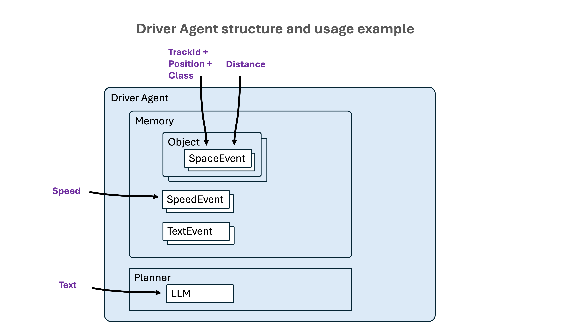

# Basic Multimodal Agentic Driver Assistant (MADA)

The goal is having a driver assistant as complete as possible with the following components:
- an RGB and Depth camera: Intel Realsense D435i
- a cell phone: Samsung
- a computer: Apple M1 with just 8 GB of RAM

The only outputs are speech audio warnings or suggestions.

Next figure shows the functional blocks of MADA.

There are several sensors and processing modules:
- the **camera** takes RGB and depth images. They are processed by the **Object Detector** in the computer, which detects objects (cars, traffic lights) and provides the object class, the bounding box and the position, along with the mean distance from the camera
- the **cell phone** gets the **speed** from the GPS, **recognizes driver speech requests**, gets the coordinates from the **accelerometer** and **gyroscope**, and sends all this data to the computer. On the other hand, the cell phone **provides wi-fi** to the computer.

All the data at the output of the processing modules are sent to the **Driver Agent**, which converts them into events 
to be stored in the Memory and analyzed in the Planner to assess if some action should be initiated.

Next figure shows the Driver Agent structure.

 There are two types of actions:
- **automatic actions**: respond to one or more events that reflect some danger or warning. An example can be detecting that the distance to a car in front is lower than the safety distance.
- **request motivated actions**: respond to a speech request from the driver. An example could be checking if there is a safety distance with a bus in front. Those requests are sent to an LLM in the Planner which can select a function to be called.

## Code structure
The code is divided in two folders:
- **mada_android**: contains two project folders for two apps to be built in Android Studio and installed in an Android cell phone
- **mada_mac**: contains python files implementing the Driver Agent modules that run on a computer (a Mac M1, currently)

### MADA Android
There are two Kotlin apps for the Android phone: 
- **SpeedVoice**: gets the speed from the GPS and transforms the driver speech requests into text; then sends that data as webSocket messages to the webSockets server in the computer.
- **AccelGyro**: gets the coordinates from the **accelerometer** and **gyroscope**, and sends them as webSockets messages to the webSockets server in the computer

### MADA Mac
Contains the following files:
- `object_detector.py`: realsense, point-cloud, YOLO, Ultralytics tracker
- `websockets_server.py`: implements a webSockets server that receives websocket messages from the processing modules (apps in the cell phone and object detector in the computer) and converts them into events to be processed 
- `driver_agent.py`
- `memory.py`: contains all class definitions to support the persistence of objects and events:
  - Memory: container of objects and events
  - Object: all the entities that can be detected by the object detector: car, bus, person, traffic light, traffic sign. Defined by a class type and a track id (which remains in successive frames to uniquely identify the object instance)
  - SpaceEvent: associated to an object instance. Defined by a bounding box, a position (left, front, right, depending on the center of the bounding box)
  - SpeedEvent
  - ActionEvent: mainly used to avoid repeating the same action over the same object too soon 
- `planner.py`
- `functions_schema.py`: automatically generates function schemas by parsing the function definitions in a given python file. The schemas are used by the LLM in the Driver Agent's Planner to decide if a given function must be called. It also contains a FunctionParser class used by the Driver Agent's Planner to parse the JSON output of the LLM in function calling mode and ensure the function exists and is correctly called
- `text_to_speech.py`: manages the text-to-speech functionality, currently very simple: 
  - a call to Google's gtts service, which takes a text and delivers an audio file of the spoken text
  - a call to MacOS `afplay` command, which takes an audio file and plays it
- `mada.yaml`: contains the configuration parameters
- `record_rgb_and_depth_videos.py`: records RGB and depth videos to support changes in the object detector indoor without having to connect the camera.

## Execution instructions
- Connect the camera to the computer
- In the Cell Phone: turn on GPS and Shared Connection
- In the Computer:
  - link to the cell phone wi-fi
  - open a terminal, enter the virtual environment with the MADA packages and run the websockets server (which starts the Driver Agent): `python websocket_server.py`
  - open another terminal, enter the virtual environment with the MADA packages and run the object detector: `sudo python object_detector.py`
- In the Cell Phone: start the SpeedVoice and AccelGyro apps
