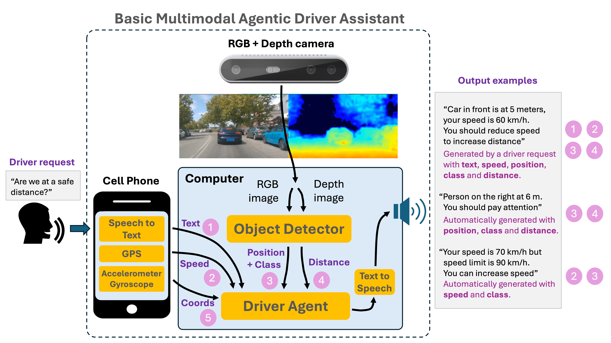
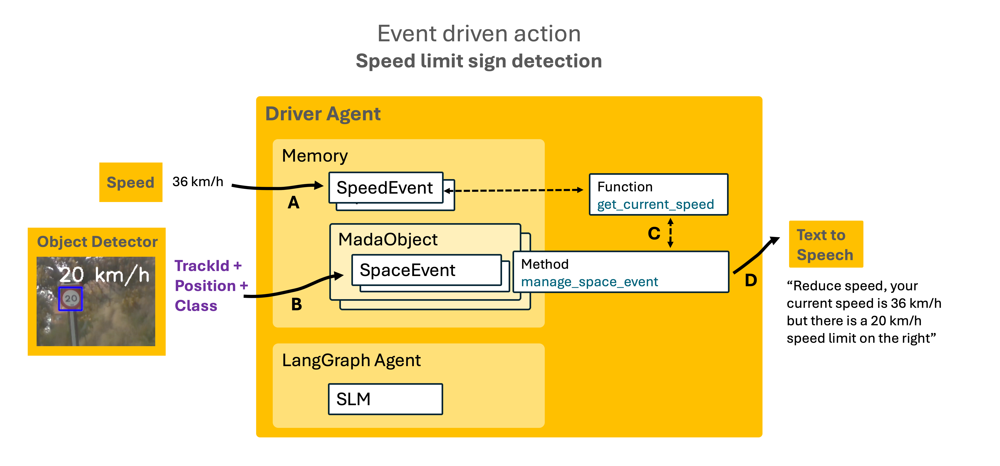
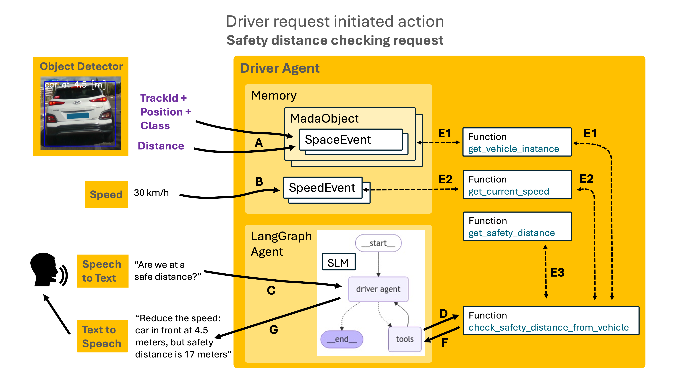

# Basic Multimodal Agentic Driver Assistant (MADA)

MADA project's goal is having a minimum, but as functional as possible, **driver assistant** that works outdoor in real-time. 
The approach is non-invasive: the only outputs are speech audio warnings or suggestions; there is no intention to take 
control of the car, just to assist the driver with audio messages.

Among the functionalities provided by MADA are:
- **safety distance checking**: If there is a vehicle in front, and the current distance is lower than the safety distance 
for the current speed, MADA warns with an audio message.
- **speed assistance**: When a speed limit traffic sign is detected, and the estimated speed is greater than the speed limit, 
MADA warns with an audio message.
- **traffic light warning**: When a traffic light is detected, depending on the current color and the transition, it warns the driver.

Next video shows some MADA functionalities:

<a href="https://www.youtube.com/watch?v=IBT4xY5QrCE">
  
</a>

**Why "multimodal" and "agentic"?**

MADA is multimodal because it includes an SLM (Small Language Model) wrapped by speech input and output, 
RGB and depth images, speed data, accelerometer and gyroscope coordinates...
MADA can also be described as "agentic" because it has the components that correspond to an Agent (sensors, memory, 
graph, actions; hence the name of the Driver Agent module), although it is still quite simple.

Regarding hardware, MADA is based on (and limited by) the following components I have at home:
- Intel Realsense D435i camera (which captures RGB and depth images)
- Samsung cell phone
- Apple M1 computer with (just) 8 GB of RAM

## MADA main parts
MADA is composed of several sensors and processing modules:
- the **camera** takes color (RGB) and depth images. They are processed by the **Object Detector** in the computer, which detects 
objects (vehicles, people, traffic signs, traffic lights) and provides the object type, the bounding box and the position, 
along with the mean distance from the camera
- the **cell phone** gets the **speed** from the GPS, **recognizes driver speech requests**, gets the coordinates from the 
**accelerometer** and **gyroscope**, and sends all this data to the computer.

The communication between the sensors/processing modules and the events handler in the computer is implemented through websockets,
which are enabled by the cell phone **wi-fi shared connection**.

All the data at the output of the processing modules are sent to the **Driver Agent**, which converts them into events 
to be stored in the Memory and analyzed to assess if some action should be initiated.

Next figure shows main MADA blocks.



### Object Detector
The goal of an Object Detection model is to analyze an image and identify which object types, out of a given list, 
are there in the image (or frame), along with the bounding box of each object. MADA's Object Detector is fine-tuned to detect 
street objects: vehicles, people, traffic signs and traffic lights. It is based on YOLO v8 Object Detector model, medium size.

**Object Tracking**

After detection, tracking is performed to keep the objects uniquely identified in successive frames. 
Tracked objects and their associated space events are memorized in order to enable certain actions. 
The tracker is Ultralytics' ByteTracker.

**Distance**

The depth image of the Intel Realsense D435i camera has a point-cloud format, which is filtered with only the points 
inside the bounding box limits of the object instance in the RGB image. The depth of those points is averaged, 
giving an average distance from the camera to the object as a result.
It is worth mentioning that depth cameras have a confidence range of distances; in the case of the 
Intel Realsense D435i is 0.1 – 3 meters, although still has quiet accuracy up to 6-7 meters; anyway, 
it would be better to have a camera with a range up to 20 meters or so.

**Selection of fps (frames per second)**

The D435i camera may work in different resolutions (color up to 1920 x 1080 pixels, depth/infrared up to 1280 x 720) and 
different camera rates: 6, 15, 30, ... up to 300 fps (depending on the camera resolution). 

At 30 fps, the available time to process a frame is 33 ms (milliseconds); at 15 fps, it is 66 ms. On the other hand, 
the required time to process a frame in the Object Detector + Tracking is 40-60 ms, thus a frame rate of 15 (or even 30) fps 
could be acceptable for offline video: it wouldn't process in real-time, but you could record a video of the results 
in even higher frame rates and play it back in real-time.

However, since **MADA works in real-time**, I use the lowest frame rate, **6 fps**. With this rate, the available time to 
process a frame is 166 ms, which enables MADA to work in real-time; the drawback is that frame transition visual perception is 
not smooth.

### Speed estimation 
There are several MADA functionalities that leverage on the car speed. An example is checking the current speed 
against a speed limit sign and, in case current speed is greater, warn the driver to reduce the speed.

The speed is periodically provided by a Kotlin app in the cell phone that takes it from the GPS.

### Speech recognition (Speech to Text)
The driver can interact with MADA through spoken requests, which are recognised and converted into text. 

Speech recognition was initially performed in the Mac by running whisper.cpp in stream mode. 
However, the execution required 1 GB of RAM, thus I decided to implement speech recognition in the cell phone, 
in the same Kotlin app as the speed estimation. It uses the built-in capabilities of the Android cell phone.

### Driver Agent
The Driver Agent contains two modules: Memory and Planner

**Memory**

It implements the persistence of objects and events:
- MadaObject: this is the base class for all the types that can be detected by the object detector: vehicle, person, traffic light, traffic sign. 
Defined by an object type and a track id (which remains in successive frames to uniquely identify the object instance)
- SpaceEvent: attribute of a mada object instance. Defined by a bounding box, a position (left, front, right, 
depending on the center of the bounding box) and the distance to the camera
- SpeedEvent: stores the speed measured by the GPS in the cell phone
- ActionEvent: mainly used to avoid repeating the same action over the same object too soon 

**Driver Agent Graph**

The Driver Agent Graph, implemented with the **LangGraph** framework, leverages on a **Small Language Model** powered with 
**function-calling**, which is the ability that some LLMs and SLMs have to identify which function (from a given list) 
may be called to satisfy a driver request. LangGraph allows defining a graph to control the flow between the different
entities: driver request, driver agent (which manages the access to the SLM), and tools. Next figure shows LangGraph-based 
Driver Agent Graph.


LangGraph's node `tools` enables accessing the functions from the SLM by just preceding them with a `@tool` decorator.
There is also an implicit connection with the driver through the Speech-to-Text and Text-to-Speech modules.
The SLM used is Llama3.2:3b (the version with 3 billion parameters), which provides acceptable function-calling by default.

**Action types**

There are two types of actions:
- **event driven actions**: respond to one or more events that correspond to some kind of risk or danger. 
An example can be warning the driver that current speed is greater than that in a detected speed limit sign.
- **driver request initiated actions**: respond to a speech request from the driver. An example could be checking if there is a 
safety distance from a bus in front. Those requests establish a session with the Driver Agent Graph, which can call one 
or more functions to satisfy the request.

### Text to Speech
Text to Speech functionality is currently very simple: 
- a call to Google's gtts remote service, which takes a text and delivers an audio file of the spoken text. 
In case of non-coverage, gtts does not work, and the TTS functionality request is rerouted to the local package 
mycroft_mimic3_tts, which is a bit slower than gtts.
- a call to FFMPEG `ffplay` command, which takes an audio file and plays it.

### Driver Agent Usage example: event driven action

Next figure shows the Driver Agent structure with an example of use, an event action triggered by a detection of a speed limit sign.



**A** Speed measurements are periodically collected from the GPS in the cell phone and sent to the server in the computer, 
where they are stored as speed events in the Driver Agent’s Memory.

**B** The Object Detector scans RGB images at a given frame rate from the camera in order to detect MADA objects:
people, vehicles, traffic signs, traffic lights. When a MADA object is detected and tracked, a Space event is generated
as attribute of the MADA object, consisting of the detected class name, the trackId, the bounding box and the distance to the camera.
In this case, the Object Detector has detected a 20 km/h speed limit sign. A SpeedLimit object is created and a Space Event is added.

**C** MADA object's `manage_space_event` method calls the function `get_current_speed`.

**D** The method verifies that current speed is greater than the speed limit, therefore it generates a text recommending 
the driver to reduce the speed. The text is sent to the TTS to be converted to audio.


### Driver Agent Usage example: driver request initiated action
Next figure shows another example of use, a driver request initiated action, and includes interaction with LangGraph-based 
Driver Agent Graph.



**A** The Object Detector scans RGB images at a given frame rate from the camera in order to detect MADA objects:
people, vehicles, traffic signs, traffic lights. When a MADA object is detected and tracked, a Space event is generated
as attribute of the MADA object, consisting of the detected class name, the trackId, the bounding box and the distance to the camera.

**B** Speed measurements are periodically collected from the GPS in the cell phone and sent to the server in the computer, 
where they are stored as speed events in the Driver Agent’s Memory.

**C** The driver requests if the distance to the vehicle in front is safe; the request is recognized in the cell phone, 
converted to text and sent to the SLM (Small Language Model) in the Driver Agent's Planner.

**D** The SLM scans the functions available and identifies one that may satisfy the driver request: 
`check_safety_distance_from_vehicle`

**E** The function calls the function `get_vehicle_instance` to get the car's space event data (which includes the position 
and the distance), the function `get_current_speed` and the function `get_safety_distance` (with current speed as parameter).

**F** With the previous data, the function checks that the distance to the car in front is lower than the safety distance 
at the current speed, and generates a text recommending the driver to reduce the speed. The text is sent to the TTS to be 
converted to audio.


## Datasets
The current version of MADA's Object Detector is a customization of the YOLO v8 Object Detector model, fine-tuned with 
images and annotations (when available) from several datasets:
- **Microsoft's COCO (Common Objects in COntext)**: includes more than 80 general image types, from which a few are useful 
for MADA: person, car, bus, bicycle, truck, motorcycle.
- **GTSDB (German Traffic Sign Detection Benchmark)**: composed of images and annotations of more than 40 traffic sign classes, 
and some of them have been selected for MADA: speed limits, stop, give way, roundabout, pedestrian crossing...
- **DFG-TSD (DFG Traffic Sign Dataset; DFG is a Slovenian company)**: includes more than 200 Traffic sign classes, 
some of which have been selected to complement those less represented in GTSDB or not included: some speed limits, 
dead end street, no left turn, no right turn, no priority.
- **S2TLD (SJTU Small Traffic Light Detection; SJTU is Shanghai Jiao Tong University)**: provides traffic light images 
and annotations, with separate types for red, green and yellow lights.

### Image annotation

Since images from each of the datasets might have non-annotated instances of classes considered only in another dataset, 
I had to review the whole dataset to add annotations (labels and bounding boxes) for the non-annotated instances. 
For instance, next image's label file from the S2TLD dataset had only an annotation of a traffic light, thus I added annotations of a car,
a no-entry sign and a speed limit sign.


The merging of images and annotations from different datasets, and the addition of new annotations, was done in the **Roboflow platform**.

**Speed limit signs and OCR**

Initially, I considered each speed limit as a separate type; since it is difficult to get a balanced number images from all speed limits, 
it was also difficult to make the YOLO model detect them properly: the confusion matrix showed there were frequent inter-speed limit errors. 
Then I decided to merge all the speed limits into just one type and apply an OCR (Optical Character Recognition) package 
to the bounding box image. The OCR package I use is PaddleOCR.

**Traffic lights transitions**

Initially, there were separate types for red, green and yellow lights. However, I realized it is convenient to manage 
transitions between lights as states inside the same traffic light instance; for example, green to yellow is interpreted as a speed reduction action, 
while red to yellow is interpreted as a pedestrian crossing warning, both inside the same traffic light instance.
Therefore, I decided to merge the 3 traffic light types into one, where the state corresponds to the color which is
assigned by applying classic image processing techniques to the bounding box image.

### Final dataset

After the speed limits and traffic lights mergings, the resulting dataset is composed of **3160 training images** and 
**750 validation images**, and the corresponding label files which totalize a **minimum of 200 annotations of 23 different image classes**.

The dataset is available at Roboflow Universe:

https://universe.roboflow.com/alberto-julian-7z4dc/mada-driver-assistant-redu.

## Object Detector Training

Once the images and annotations from the previous datasets have been compiled in the resulting dataset, and the additional 
annotations have been defined, I used a jupyter notebook running on Google Colab to train the Object Detector. 
After 20 epochs, the evolution of the mean Average Precision (50 and 50-95) is shown in next figure:


On the other hand, the normalized Confusion Matrix is shown in next figure:


From the last two figures, it can be observed that there is room for improvement; possible actions would be:
- training more epochs
- adding more examples of the most confused classes
- yolo model hyperparameter tuning

However, when I tested MADA in a real environment, the most common classes were properly detected in most cases, so I decided to terminate 
the first training stage.

Next image shows detection examples of the most common classes during a MADA tour:


## Code structure
The code is distributed in four folders:
- **android-apps**: contains two project folders for two Android apps
- **object-detector**: contains python files implementing the **Object Detector** module functions
- **driver-agent**: contains python files implementing the **Driver Agent** module
- **common**: contains python files for the **Text to speech** module, and other python files used by the other modules

There is also a configuration file, `mada.yaml`, which contains the configuration parameters that are used by the 
python functions and classes in the object-detector and driver-agent folders.

### android-apps
Contains two project folders for two Kotlin apps to be built in Android Studio and installed in an Android cell phone: 
- **SpeedVoiceWebSocket**: gets the speed from the GPS and transforms the driver speech requests into text; then sends 
that data as webSocket messages to the webSockets server in the computer. The Speed is provided by the **com.google.android.gms.location** 
package, which gets the data from the GPS sensor. The driver speech is recognised and converted into text by the package **android.speech.SpeechRecognizer**.
- **AccelGyroWebSocket**: gets the coordinates from the **accelerometer** and **gyroscope**, and sends them as webSockets 
messages to the webSockets server in the computer. The Accelerometer and Gyroscope coordinates are provided by the **android.hardware.Sensor** package.

### object-detector
Contains the following python files:
- `2024-10-13_traffic_signals_Robo_yolov8.ipynb`: this is the notebook to train the yolo model with the resulting dataset
- `object_detection_loop.py`: implements the object detection and tracking loop; in "live" mode it captures the RGB and Depth images 
from the camera; otherwise, it takes them from recorded videos (I use them to test indoor changes in the object detector).
- `object_detector.py`: it implements the object detector and tracker; it also applies OCR to the speed limit signs bounding boxes.
- `realsense_camera.py`: implements the RealSenseCamera class, which wraps all the RealSense camera code.
- `recorded_video_manager.py`: implements the RecordedVideoManager, which manages offline recorded videos (I use them to test indoor changes in the object detector).
- `record_rgb_and_depth_videos.py`: records RGB and depth videos to test changes in the object detector indoor without having to use the camera outdoor.

It also contains other files used by the python files:
- `yolov8m.pt`: customized model used by the object detector

### driver-agent
Contains the following python files:
- `driver_agent_events_handler.py`: implements the driver agent events handler through a webSockets server that receives 
websocket messages from the processing modules (apps in the cell phone and object detector in the computer) and converts 
them into events to be stored and processed
- `driver_agent.py`: implements the DriverAgent class, which contains as attributes the Memory and Planner classes; 
implements the Planner class, which manages the SLM that supports the **driver request initiated actions**; it also performs 
the evaluation of both automatic and request initiated actions
- `memory.py`: contains all class definitions to support the persistence of base objects and events
- `mada_classes.py`: implements all the classes (which inherit from the base class MadaObject) with the behaviour of 
specific MADA types: vehicles, people, traffic signs, traffic lights
- `functions.py`: includes the definition of the functions supporting the driver assistance actions
- `functions_schema.py`: automatically generates function schemas by parsing the function definitions in `functions.py`. 
The schemas are used by the SLM in the Driver Agent's Planner to decide if one of the existing functions must be called. 
It also contains a FunctionParser class used by the Driver Agent's Planner to parse the JSON output of the SLM in function calling 
mode and ensure the function exists and is correctly called

### common
Contains python files used both by the object detector and the driver agent:
- `text_to_speech.py`: includes the functions to manage the text-to-speech functionality
- `utils.py`

## Installation instructions
Clone the repository:
```
git clone https://github.com/albertojulian/mada-driver-assistant.git
```
### Android apps
- Copy the folders in android-apps into AndroidStudioProjects
- Open Android Studio
- Connect the cell phone with a USB cable

### Object Detector
Install ffmpeg and the libusb library with homebrew (Realsense camera needs a dual version of libusb: arm and x86)
```
brew install ffmpeg libusb
```

Create a virtual conda environment and activate it:
```
conda create --name OBJECT_DETECTOR python=3.9.9
conda activate OBJECT_DETECTOR
```

Use conda to install torch
```
conda install -c pytorch pytorch=2.2.1 torchvision=0.17.1
```

Use conda to install opencv (includes the python wrapper)
```
conda install -c conda-forge opencv=4.8
```

Use pip to install the libraries in requirements.txt
```
cd object-detector; pip install -r requirements.txt
```

### Driver Agent
Install Ollama

Create a virtual conda environment and activate it:
```
conda create --name DRIVER_AGENT python=3.9.9
conda activate DRIVER_AGENT
```

Use conda to install torch
```
conda install -c pytorch pytorch=2.2.1 torchvision=0.17.1
```

Use pip to install the libraries in requirements.txt
```
cd driver-agent; pip install -r requirements.txt
```


## Execution instructions
- In the Cell Phone: 
  - turn on GPS and Shared Connection
- In the Computer:
  - connect the camera to the computer
  - link to the cell phone wi-fi
  - open a terminal
    - activate the virtual environment with the Driver Agent packages: 
       ```
       conda activate DRIVER_AGENT
       ```
    - run the ollama model
       ```
       ollama run gemma2:2b  # then /exit
       ```
    - run the Driver Agent events handler: 
       ```
       cd driver-agent
       python driver_agent_events_handler.py
       ```
  - open another terminal
    - activate the virtual environment with the Object Detector packages
       ```
       conda activate OBJECT_DETECTOR
       ```
    - run the Object Detection loop: 
       ```
       cd object-detector
       sudo python object_detection_loop.py
       ```
- In the Cell Phone: 
  - start the SpeedVoice (and AccelGyro) app

## Future work
- Fine-tune the SLM model to enable more specific and complex requests
- Provide functionality for the Accelerometer and Gyroscope events
- Add left and right back cameras to track blind spots, in order to enable detection of vehicles in those directions when trying to move to left or right lane

## References
**COCO dataset**:
- [official website](https://cocodataset.org):  https://cocodataset.org/
- paper:
```bibtex
- @article{lin2014microsoft,
  title={Microsoft COCO: Common Objects in Context},
  author={Lin, Tsung-Yi and Maire, Michael and Belongie, Serge and Hays, James and Perona, Pietro and Ramanan, Deva and Doll{\'a}r, Piotr and Zitnick, C. Lawrence},
  journal={arXiv preprint arXiv:1405.0312},
  year={2014}
}
```

**GTSDB dataset**:
```bibtex
@inproceedings{Houben-IJCNN-2013,
   author = {Sebastian Houben and Johannes Stallkamp and Jan Salmen and Marc Schlipsing and Christian Igel},
   booktitle = {International Joint Conference on Neural Networks},
   title = {Detection of Traffic Signs in Real-World Images: The {G}erman {T}raffic {S}ign {D}etection {B}enchmark},
   number = {1288},
   year = {2013},
}
```

**DFG-TSD dataset**:
```bibtex
@article{Tabernik2019ITS,
   title = {{Deep Learning for Large-Scale Traffic-Sign Detection and Recognition}},   
   author = {Tabernik, Domen and Sko{\v{c}}aj, Danijel},
   journal = {IEEE Transactions on Intelligent Transportation Systems},
   year = {2019},
   doi={10.1109/TITS.2019.2913588}, 
   ISSN={1524-9050}
}
```

**S2TLD dataset**:
```bibtex
@article{yang2022scrdet++,
  title={Scrdet++: Detecting small, cluttered and rotated objects via instance-level feature denoising and rotation loss smoothing},
  author={Yang, Xue and Yan, Junchi and Liao, Wenlong and Yang, Xiaokang and Tang, Jin and He, Tao},
  journal={IEEE Transactions on Pattern Analysis and Machine Intelligence},
  year={2022},
  publisher={IEEE}
}
```